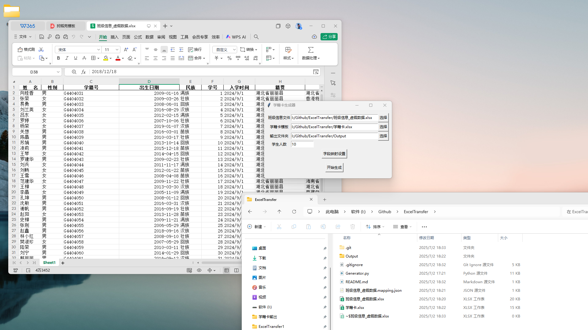
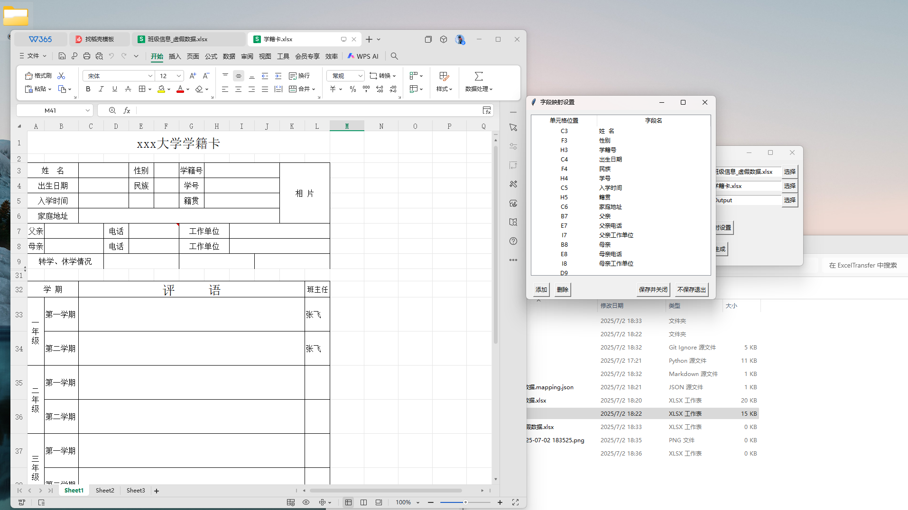
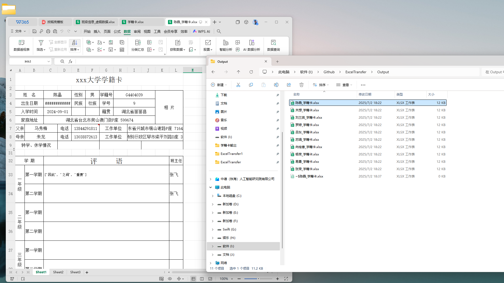

# Excel 自动生成器

一个基于 Python 和 Tkinter 的图形化工具，用于根据数据源 Excel 文件和模板 Excel，批量生成填充后的 Excel 文件。支持字段自动匹配、字段映射配置、日期格式保留、合并单元格处理等功能。

---

## ✅ 功能特性

- 支持从数据集 Excel 中提取信息
- 可自动识别模板中的字段位置（兼容合并单元格）
- 映射配置支持图形化编辑，并可保存到本地
- 日期字段自动判断是否带有时分秒并保留原格式
- 自动以指定字段（如“姓名”）或首列内容命名输出文件
- 每条数据生成一个独立的 Excel 文件
- 映射配置自动保存在 `Save/` 文件夹中

---

## 🧩 安装依赖

请先安装 Python（建议版本 Python 3.7 以上），并使用 pip 安装必要依赖：

```bash
pip install pandas openpyxl
```

---

## 🚀 使用方法

1. 打开终端或命令行，运行以下命令启动程序：

   ```bash
   python main.py
   ```

2. 启动后，按界面提示依次完成以下步骤：

   - 选择 **数据集 Excel 文件**（包含需要填充的数据）
   - 选择 **模板 Excel 文件**（用于生成的格式模板）
   - 选择 **输出文件夹**
   - 设置 **生成数量**（表示从数据集中取前多少行进行生成）
   - 点击 **“自动识别”**：自动识别字段映射
   - 点击 **“字段映射设置”**：查看并确认字段匹配关系
   - 点击 **“开始生成”**：批量生成填充好的 Excel 文件

---

## 🧠 字段自动识别规则

字段识别时程序会：

- 对比数据集中的列名与模板中的单元格文本
- 如果模板单元格是合并单元格，则以最右侧单元格为基准
- 如果该单元格右侧为空，则认为为目标填充位置
- 若右侧不为空，则尝试其下方单元格是否为空
- 若都不为空，则视为未找到可填充位置

---

## 💾 映射配置保存路径

字段映射配置将自动保存在数据源 Excel 同级目录下的 `Save/` 子目录中，例如：

```
D:/项目数据/Save/数据文件.mapping.json
```

如果该映射文件存在，将在启动时自动加载；否则需通过“自动识别”或手动设置完成字段映射。

---

## 📝 输出命名规则

- 若数据表中存在 `"姓名"` 字段（不区分空格），将使用该列内容作为输出文件名
- 若无该字段，则使用 Excel 数据表的第一列内容
- 若该值为空，则使用默认命名，例如：`记录1.xlsx`、`记录2.xlsx` 等

---

## 🕓 日期格式处理

程序会自动检测字段类型是否为日期：

- 若为日期时间类型，且时间部分为 00:00:00，仅写入日期部分（如 `2025-07-01`）
- 若时间不为 0，完整写入日期时间（如 `2025-07-01 09:15:30`）

---

## ✅ 系统兼容

- 推荐平台：Windows（内置 GUI 界面）
- 支持 Mac/Linux（需具备 Tkinter 环境）
- 需要 Python 3.7 及以上版本
- 所有输出文件均为 `.xlsx` 格式

---

## 📁 示例目录结构

```
项目目录/
│
├─ main.py                   # 主程序
├─ 模板.xlsx                 # 模板文件
├─ 数据.xlsx                 # 原始数据
├─ Save/
│   └─ 数据.mapping.json     # 映射配置文件
└─ 输出/
    └─ 张三.xlsx             # 批量生成的 Excel 文件
```

---

## 图文教程
#### 1.首先准备好需要拆分的数据集,像图中的班级信息表，同时准备好需要生成的模板表格，类似图中的学籍卡

#### 2.设置好映射关系，如果觉得麻烦可以自动生成，但是自动生成映射可能会不准，最好还是手动设置并保存，为了提高自动映射的准确性，请在模板中把需要填的表格空出来，删掉不要的示例数据。同时确定模板中的字段跟数据集的字段尽可能地相同，比如图中学籍卡的姓名，性别，学籍号和数据集的姓名，性别，学籍号。

### 3.点击生成，生成的数据会在指定的输出文件夹，如果想生成多几行数据，把左边的10改成自己定义的行数，比如数据集总共有120行就写120行。<span style="color:red">(定行数10是为了方便测试，否则如果数据位置不准，就白白浪费时间。)</span>


## 📮 联系方式

如需定制功能、报告 Bug 或其他建议，欢迎联系项目作者。
